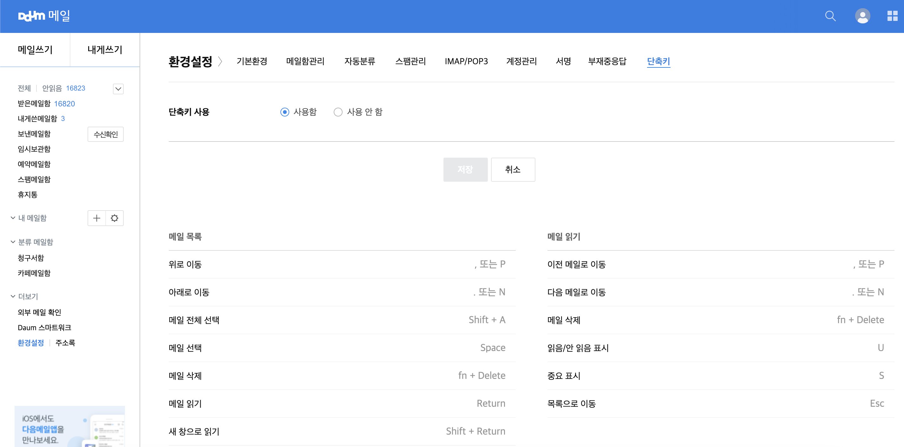
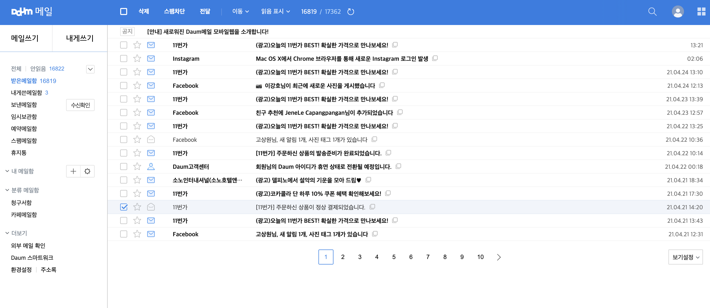
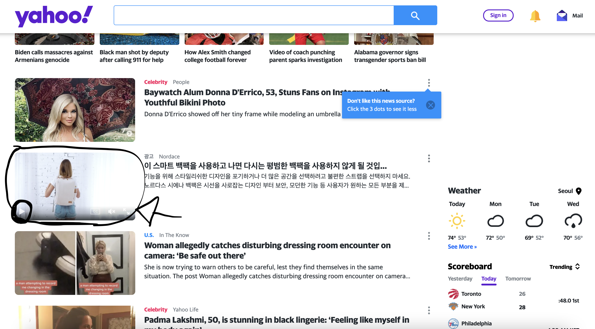
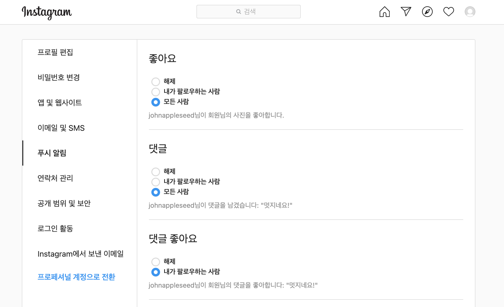
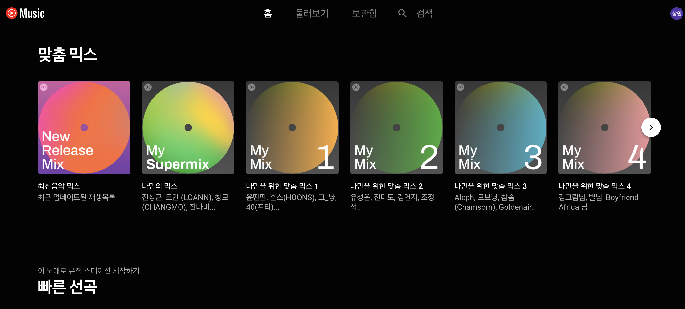

# 2. Operable
## 2.1 Keyboard Accessible
> 모든 기능을 키보드로 이용할 수 있게 한다. 

### 2.1.1 Keyboard
> (키보드) 기본 기능을 이용하려면 끝점(endpoint)만이 아니라 사용자의 이동 경로에 따라 입력을 달리해야 하는 경우를 제외하고, 개별 키 입력 시 특정한 시간적 제약 없이 키보드 인터페이스를 이용해서 콘텐츠의 모든 기능을 조작할 수 있다.

### 2.1.2 No Keyboard Trap
> (키보드 함정 제거) 키보드 인터페이스를 이용해 키보드 포커스를 페이지의 컴포넌트로 이동할 수 있다면 오직 키보드 인터페이스를 이용해 해당 컴포넌트에서 포커스를 제거할 수 있다. 이때 수정되지 않은 화살표나 탭 키 또는 다른 표준 종료 방법 이외의 방법이 필요하다면 그 방법을 사용자에게 안내한다.

### 2.1.3 Keyboard(No Exception)
> (키보드 - 예외 없음) 콘텐츠의 모든 기능은 개별 키 입력 시 특정한 시간적 제약 없이 키보드 인터페이스로 조작할 수 있다.

### 2.1.4 Character Key Shortcuts
> 문자나, 문장 부호, 번호, 기호만을 이용해서 콘텐츠에 키보드 단축키를 구현한 경우, 다음 중 하나를 만족한다.
<table>
  <tr>
    <th>해제</th>
    <td>단축키를 해제할 수 있는 메커니즘을 제공한다.</td>
  </tr>
  <tr>
    <th>재설정</th>
    <td>하나 이상의 출력할 수 없는 키보드 문자(예: Ctrl, Alt 등)를 이용하도록 단축키를 재설정할 수 있는 메커니즘을 제공한다.</td>
  </tr>
  <tr>
    <th>포커스 시에만 활성화</th>
    <td>사용자 인터페이스 컴포넌트의 키보드 단축키가 해당 컴포넌트에 포커스가 있을 때만 활성화된다.</td>
  </tr>
</table>
  
- 사례: DAUM 메일
  - DAUM 메일에서는 단축키를 해제할 수 있는 메커니즘을 제공한다.
  

  - DAUM 메일에서 메일을 읽음/읽지 않음 상태로 변환하는 키보드 단축키(`U`)를 눌렀을 때 각 메일에 포커스되어 있지 않으면 작동하지 않고 포커스가 있을 때만 활성화된다.
  

## 2.2 Enough Time
### 2.2.1 Timing Adjustable
> (시간 제한 조정 기능) 콘텐츠에서 설정한 시간 제한에 대하여 다음 중 하나 이상을 만족한다.
<table>
  <tr>
    <th>해제</th>
    <td>사용자가 시간 제한을 해제할 수 있다.</td>
  </tr>
  <tr>
    <th>조정</th>
    <td>사용자가 시간 제한을 기본 설정값의 열 배 이상으로 조정할 수 있다.</td>
  </tr>
  <tr>
    <th>연장</th>
    <td>시간이 만료되기 전에 사용자에게 경고하고 간단한 동작으로(ex.스페이스 바 누르기) 시간 제한을 연장할 수 있도록 20초 이상의 시간을 제공한다. 사용자는 시간 제한을 10번 이상 연장할 수 있다.</td>
  </tr>
  <tr>
    <th>실시간 예외</th>
    <td>시간 제한이 실시간 이벤트(예를 들면, 경매)의 일부로 필요하고, 시간 제한에 대한 대체 방안이 없다.</td>
  </tr>
  <tr>
    <th>필수 예외</th>
    <td>시간 제한이 필수적이고 시간 제한을 연장하면 해당 작업이 무효화된다.</td>
  </tr>
  <tr>
    <th>20시간 예외</th>
    <td>시간 제한이 20시간 이상이다.</td>
  </tr>
</table>

- 사례: 대학교 종합정보시스템
  - 연장 속성을 만족하는 사례로 대학교 종합정보시스템 오른쪽 상단에 시간 제한을 연장할 수 있도록 하는 버튼이 존재한다. 또한, 시간이 만료되기 전 사용자에게 경고하여 연장할 수 있도록 알림창으로 도움을 준다. 
 

### 2.2.2 Pause, Stop, Hide
> (정지 기능 제공) 자동으로 변경되는 콘텐츠는 움직임을 제어할 수 있어야 한다.
<table>
  <tr>
    <th>이동, 깜빡임, 스크롤</th>
    <td>움직이거나 깜박거리거나 스크롤되는 정보가 (1) 자동 시작, (2)5초 이상 지속, (3) 다른 콘텐츠와 병행해서 표시되는 경우, 그러한 이동이나 깜박임, 스크롤이 필수적인 작업의 일환이 아니라면 사용자가 정보를 일시 정지 또는 중지하거나 숨길 수 있는 메커니즘이 있다.</td>
  </tr>
  <tr>
    <th>자동 업데이트</th>
    <td>자동 업데이트되는 정보가 (1) 자동 시작, (2) 다른 콘텐츠와 병행해서 표시되는 경우, 그러한 자동 업데이트가 필수적인 작업의 일환이 아니라면 사용자가 정보를 일시 정지 또는 중지하거나 숨기거나 업데이트 주기를 제어할 수 있는 메커니즘이 있다.</td>
  </tr>
</table>

- 사례: 야후 메인 페이지
  - 야후 메인 페이지에는 자동으로 시작되는 동영상 콘텐츠가 있으며 일시 정지를 할 수 있는 매커니즘이 존재한다.
<figure>
  
</figure>

### 2.2.3 No Timing
> (시간 제약 제거) 비대화형 동기화 미디어와 실시간 이벤트를 제외하면, 시간 제약은 콘텐츠에서 표현하는 이벤트나 작업에서 필수적인 부분이 아니다.

### 2.2.4 Interruptions
> (인터럽트) 비상사태와 관련된 경우를 제외하고, 사용자가 콘텐츠의 인터럽트를 보류하거나 멈출 수 있다.
- 사례: 인스타그램 푸시 알림 설정
  - 인스타그램에서 사용자가 임의적으로 푸시 알림(인터럽트)를 제어할 수 있다.
<figure>
  
</figure>

### 2.2.5 Re-authentication
> (재인증) 인증 세션이 만료되면 사용자는 재인증 후 데이터 손실 없이 활동을 계속할 수 있다.
- 사례: 유튜브 뮤직 개인 내역
  - 인증 세션이 완료된 후 재인증을 하면 사용자별 정보는 손실 없이 유지 된다.
<figure>
  
</figure>

### 2.2.6 Timeouts
> (타임아웃) 사용자 활동이 없을 때 데이터가 20 시간 이상 보관되지 않는 한, 사용자의 활동이 없으면 데이터가 유실될 수 있음을 사용자에게 경고한다.

## 2.3 발작 및 신체 반응
> 발작, 신체적인 반응을 일으키는 것으로 알려져 있는 방식으로 콘텐츠를 디자인하지 않는다.

### 2.3.1 번쩍임을 세 번 또는 임곗값 이하로 설정 (level A)
> 1 초에 3번 이상 번쩍이는 것을 페이지에 포함하지 않고, 번쩍이는 효과는 일반 섬광, 적색 섬광 임곗값 이하로 설정해야한다.
#### 사례
1. Pokemon Shock 
* 1997년도에 4:3 화면으로 4초간, 꽉찬 화면으로 2초간 번쩍이는 효과를 연출했는데, 방송을 보던 시청자 일부가 발작을 일으켜 병원으로 후송되는 사건이 있었다.  

### 2.3.2 세 번 번쩍임 (Level AAA)
> 1초에 세 번 이상 번쩍이는 것을 웹 페이지에 포함하지 말아야 한다.

### 2.3.3 인터랙션으로 인한 애니메이션 효과 (Level AAA)
> 애니메이션이 전달되는 정보에 필수적이지 않다면 모션 애니메이션의 비활성화가 가능해야 한다.

#### 사례
1. 라인 플러스
* 라인 플러스의 경우 사이트에 들어가는 순간 사이트의 2/3 이상을 차지하는 배너에서 바로 애니메이션 효과가 시작되고, 이를 비활성화할 수 있는 기능이 제공되지 않고 있다.  

  

출처 : https://linepluscorp.com/  

2. 라인

* 라인 플러스와는 다르게 빠르게 바뀌는 애니메이션 효과는 아니지만, 그다지 필수적인 정보를 제공하는 애니메이션 효과가 아닐 뿐더러 마찬가지로 비활성화 기능을 제공하고 있지 않다.

  

출처 : https://line.me/ko/

3. MAC 과 Window 에서 설정하기
* OS 환경에서의 설정으로 이런 애니메이션 효과를 줄일 수 있다.  

출처 : https://naradesign.github.io/wcag-2.1.     html#251-pointer-gestures-level-a

  

  

출처 : https://www.youtube.com/watch?time_continue=11&v=uANmA7korfs&feature=emb_title

## 2.4 탐색성
> 사용자가 콘텐츠를 탐색하고 검색하면서 자신의 위치 확인이 가능한 방법을 제공해야 한다.

### 2.4.1 블록 우회
> 여러 웹 페이지에서 반복하는 콘텐츠 블록을 우회할 수 있어야 한다.
* 이를 위해 링크 텍스트를 설명력 있고 이해하기 쉽도록 제공하는 방법도 좋지만, 적절한 **헤딩**을 제공하는 것 또한 중요하다. **헤딩**은 콘텐츠 블럭을 건너 뛸 수 있는 단서를 제공한다. 
* 메뉴 건너 뛰기 링크를 제공함으로서 반복되는 콘텐츠 블럭을 건너 뛸 수 있도록 할 수 있다. 
* 네이버 지식 iN 사이트에서 키보드로 접근시에 반복 영역 건너뛰기를 확인 할 수 있다.
* 하지만 이러한 메뉴는 시각 장애인만 필요한 메뉴가 아니라, 손과 발을 자유롭게 사용할 수 없는 마우스 스틱을 사용하는 사람들에게도 필요하다. 따라서 항상 숨김 처리를 해 놓는 것은 문제가 될 수도 있다.

#### 사례
1. 지식in
* 지식인에서 tab 버튼을 누를 경우에 메뉴 건너 뛰기 링크를 제공한다. 이를 통해서 원하는 영역으로 건너 뛰기가 가능해 필요한 내용을 찾기 위해 계속해서 내부 내용들에 접근할 고생이 줄어든다.  

출처 : https://kin.naver.com/

### 2.4.2 페이지 제목 설정
> 웹 페이지에는 주제나 목적을 설명하는 제목이 있어야 한다.
* 각 웹 페이지에 설명이 있는 제목을 확인하고 사용자가 내용을 찾고 방향을 잡도록 도와주는 것을 목적으로 한다.
* 이를 통해서 사용자는 필요한 컨텐츠를 빠르게 식별하는 것이 가능하다.

#### 사례

1. W3.org
* w3.org 에서는 명확하게 주제나 목적을 설명하는 제목을 기입해놓았다. 이를 통해 필요한 내용을 빠르게 식별하는 것이 가능하다.  

  

출처 : https://w3.org/

### 2.4.3 포커스 순서
> 웹 페이지는 순차적인 탐색이 가능해야 하고 탐색 순서가 의미나 조작에 영향을 준다면, 의미와 조작성을 유지하는 순서로 포커스가 가야한다.
* 사용자가 콘텐츠를 순차적으로 탐색할 때 콘텐츠의 의미와 일치하도록 하고 키보드를 조작하며 순서대로 정보를 접근하도록 하기 위한 목적이다.

#### 사례
1. 네이버

* 네이버 홈페이지에서는 논리적인 순서로 시각적인 구별이 가능하도록 제공한다.
* 좌에서 우, 상에서 하로 진행하고, 초점이 논리적으로 이동하는 선에서의 tabindex 사용을 제한하고 있다.

출처 : https://nuli.navercorp.com/guideline/s02/g09

### 2.4.4 링크 목적(컨텍스트)
> 각 링크의 목적은 링크 텍스트 만으로, 링크 텍스와 프로그래밍 방식으로 확인된 링크 컨텍스트로 확인 할 수 있다. 하지만 링크의 목적이 전반적으로 모호한 경우에는 제외할 수 있다.
* 만약 인지 장애가 있는 사용자의 경우 링크를 통해 어디로 이동되는지에 대한 충분한 정보를 제공 받지 못한다면 혼란스러울 수도 있다.
#### 사례
1. 네이버 쇼핑
* 법적고지 및 주의사항을 보려면 **여기** 를 클릭하시오. 와 같은 텍스트가 아닌 정확하게 **법적고지 및 주의사항** 자체를 텍스트로 주고 있다. 이를 통해 사용자는 링크를 통해 이동 가능한 영역을 명확하게 알 수 있다.

출처 : https://shopping.naver.com/

### 2.4.5 여러 가지 방법
> 웹 페이지가 어떤 프로스세의 결과나 단계인 경우를 제외하고 웹 페이지의 위치를 찾는 방법이 하나 이상 존재해야 한다.
* 사용자는 자신에게 가장 적합한 방식으로 콘텐츠를 찾을 수 있어야 한다.
* 시각 장애가 있는 사용자는 화면 돋보기나 화면 판독기를 사용해 검색을 사용해 원하는 곳으로 쉽게 이동이 가능할 수 있다.
* 인지 장애가 있는 경우 사이트의 개요를 제공하는 목차나 사이트 맵을 사용하는 것을 선호할 수도 있다.

### 2.4.6 제목과 레이블
> 제목과 레이블은 주제나 목적을 설명한다.
* 사용자가 웹 페이지에 포함된 정보와 해당 정보가 어떻게 구성되어 있는지를 쉽게 이해할 수 있도록 도와주는것을 목적으로 한다.
* 라벨과 표제는 길지 않아도 되며 단어 또는 단일 문자로 내용을 찾고 탐색하기 위한 정보만을 제공하는 것으로 충분하다.

### 2.4.7 포커스 표시
> 사용자 인터페이스는 키보드 포커스 표시기가 보이는 조작 모드를 제공해야 한다.
* 사용자가 키보드 포커스를 가진 여러 요소들 사이에서 자신이 포커스한 요소를 인지할 수 있어야 한다.
#### 사례
1. 네이버
* 자신이 포커스한 내용이 인지 할 수 있도록 테두리를 제공하고, 이를 통해 세부 내용으로 넘어갈때에도 포커스를 제공해준다.

출처 : https://www.naver.com/

2. 아이서울유
* tab 을 눌러보면서 진행하던중에 내가 어디에 포커스 되있는지 시각적으로 확인하기 부족한 부분이 있었다. 
* 포커스 표시는 되었지만 미미하게 표시되어 있어 제대로 찾기가 힘들었다.

출처 : http://iseoulu.co.kr/

### 2.4.8 위치
> 일련의 웹 페이지 내에서 사용자의 위치 정보를 이용할 수 있다.

### 2.4.9 링크 목적(링크)
> 링크 텍스트만으로 각 링크의 목적을 확인할 수 있게 하는 메커니즘을 이용할 수 있어야 한다. 역시 전반적으로 사용자에게 모호한 경우는 제외한다.
#### 사례

1. 네이버

* **여기** 라는 명확하지 못한 링크 텍스트 대신 해결 방안과 같은 정확한 텍스트를 제공해야 한다.

### 2.4.10 절 제목
> 절 제목을 이용해서 콘텐츠를 구성해야 한다.

## 2.5 입력 형식
> 키보드 외에 다양한 입력을 통해 사용자가 보다 쉽게 기능을 조작하는 것이 가능하다.

### 2.5-1 포인터 제스처
> 다중 포인트나 경로 기반 제스처를 사용해 조작하는 모든 기능은 필수적인 경우가 아니면 경로 기반 제스처 없이 단일 포인터로 조작이 가능하다.
* 만약 두 손가락이나 복잡한 움직임이 필요한 제스처의 경우 손 떨림이 있거나 움직임이 제한적인 사람들은 조작하기 어렵다.
* 한 번의 터치만으로 조작이 가능하다면, 인지 기능 장애가 있는 사람 또한 기억하고 사용하기 쉽다.
#### 사례
1. 입으로 들이키고 부는 동작으로 게임을 하는 Sphincter Envy
* 입 천장의 혀 작동 시스템을 이용하는 사용자는 복잡한 제스처를 사용하기 어렵다. 따라서 멀티 터치 제스처를 사용하는 경우에는 이를 대체하는 간단한 인터페이스를 제공해야 한다.

  

2. 아이서울유의 지도
* 지도 드래그와 같은 복잡한 제스처의 경우 버튼 방식으로 제공되지 않아 사용자가 사용하기 어려울 수도 있다.

* 반면에 구글 맵의 경우 키보드를 통한 지도 드래그가 가능해 원하는 위치로 이동하기에 용이하다.

출처 : https://www.youtube.com/watch?v=4mp6dtp1mJ8&t=30s  
출처 : https://a11y.gitbook.io/wcag/2-operable/2.5-input-modalities#2-5-1-a  
출처 : https://zdnet.co.kr/view/?no=20120301072627  
출처 - https://www.google.co.kr/maps/  
출처 - http://idangero.us/swiper/  

#### 2.5-2 포인터 취소
> 싱글 포인터를 사용하여 작동하는 기능은 아래중 하나 이상이 충족되어야 한다.
   1. down 이벤트 사용 X : 포인터의 down 이벤트는 함수 일부를 실행하는데 사용해서는 안 된다.
      * 마우스 버튼을 누르거나, 터치 또는 키를 누른 순간 즉시 기능을 활성화 한다.
      * 따라서 위치를 클릭,터치 할 경우의 실수를 취소할 수 있다.
   2. 중단 또는 실행 취소 : 함수의 완료는 up 이벤트에 있고 완료 전 중단과 완료 후 취소 방법을 제공해야 한다.
      * up 이벤트를 누른 마우스에서 손가락을 떼거나, 포인터를 올리거나 키를 놓는 것을 의미한다.
      * up 이벤트에서 작업이 실행되도록 하면 올바른 위치에 있는지 확인이 가능하다.
      * 실행될 기능을 취소하기 위해 사용자는 목표 밖으로 이동해 손가락, 포인터를 놓을 수 있다.
   3. up 이벤트를 통한 취소 : up 이벤트는 이전 down 이벤트의 결과를 취소할 수 있다.
      * 사용자가 잘못된 위치를 터치시에 그 위치를 벗어나게 하여 의도치 않은 작업을 취소가 가능하다. 
   4. 필수 상황 예외 : down 이벤트가 필수적으로 작동해야 하는 경우는 예외로 한다.
      * 
      * 
* 이 지침은 실수로 잘못된 위치를 만지거나, 클릭 할 수 있는 손 떨림이 있는 경우, 운동 장애를 가진 사람들을 도우는 것을 목적으로 한다.
* 실수로 인해 의도치 않은 동작이 발생할 경우에 취소 기능을 제공하므로 인지 장애가 있는 사람들에게 도움이 될 수 있다.
* 만약 우연히 컨트롤을 활성해 했을 경우 예기치 않은 상황이 발생한다면 혼란스러울 수 있기 때문이다.
* 뿐만 아니라 일반 사용자의 경우에도 도움이 될 수 있다.

### 2.5-3 이름에 레이블 포함하기 
> 텍스트 또는 텍스트 이미지를 포함한 레이블이 있는 사용자 인터페이스 구성요소의 이름은 볼 수 있는 텍스트를 포함해야 한다.
* 시각적으로 드러난 레이블은 텍스트 이름이 되어야 한다. **프로그램 방식**으로 결정된 텍스트 이름은 화면에 드러난 레이블을 통해서 음성 명령으로 접근 가능하다.
    * 프로그램 방식 : label/for, aria-lablledby, aria-lable 과 같이 프로그램을 통해 텍스트의 이름을 의미있게 결정해주는 방식을 이야기 한다.
    * 접근 가능한 이름 : 보조 기술(스크린 리더등)에서 사용자에게 들리는 텍스트, 음성 인식 소프트웨어의 사용자가 말하는 음성 명령 실행 등을 이야기 한다.

#### 사례
1. 아이폰 구매

* 아래와 같이 그저 쇼핑하기, 구입하기 로만 이름이 구성된 경우 비장애인의 경우 이미지와 핸드폰 사진을 보며 원하는 버튼을 클릭이 가능하지만, 시각 장애인의 경우 어떤 핸드폰이 매칭되는지 알 수 없다.

* 따라서 아래와 같이 접근 가능하도록 설정해줘야 한다.

출처 : https://www.apple.com/kr/iphone/  
출처 : https://a11y.gitbook.io/wcag/2-operable/2.5-input-modalities

### 2.5-4 모션기반 작동
> 장치 모션이나 사용자 모션으로 조작할 수 있는 기능은 사용자 인터페이스 구성 요소로 동작 가능해야 한다. 
* 또한 의도치 않은 조작을 예방하기 위해 모든 응답을 끌 수 있어야 한다.
    * 지원 인터페이스: 모션이 접근성 지원 인터페이스를 통해 기능을 조작하는데 사용 가능하다. 
    * 반드시 필요한: 모션이 기능에 반드시 필요하고, 모션으로 활동을 무효화할 수 있다.
* 장치에는 가속도계와 센서와 같은 입력하는 작동하는 센서가 있다. 사용자는 방향을 변경하거나 장치를 특정 방식으로 이동함으로써 여러 기능들의 제어를 가능하게 해준다.
* 아이폰 같은 경우에 시스템 수준에서의 동작이 가능하고 원하지 않는 경우 설정을 통해 취소가 가능하다.

#### 사례
1. Shakit app

* 모션으로 인식되는 app 으로 흔들면 자주 사용하는 앱을 찾아 실행하도록 도와준다.

출처 : https://play.google.com/store/apps/details?id=kr.edcan.shakit&hl=ky

2. 서울시 안심이 app

* 스마트폰을 흔들면 긴급 상황을 전송하는 app 으로 모션 인식을 통해 바로 위험상황을 전송 가능하다.

출처 : https://www.youtube.com/watch?v=q3VCPRCdfhc

### 2.5-5 타켓 크기
> 포인터 입력용 타겟 크기는 최소 44*44 픽셀이어야 한다. 아래의 경우에는 예외로 사용이 가능하다.
    1. equivalent: 44 * 44 px 이상의 동등한 링크나 컨트롤을 통해 대상을 이용 가능하다.
    2. inline: 대상이 문장 또는 텍스트 블록 내에 있다.
    3. user agent controll: 타겟 크기를 사용자 에이전트가 결정하며 제작자는 수정하지 않는다.
    4. essential: 정보를 전달하는 데 특정한 대상 표현이 필수적이다.
* 정교한 포인팅이 어려운 사용자라도 타겟을 손쉽게 제어가 가능하다.
   * 마우스 스틱과 같은 대체 포인터를 사용하는 사람들, 손가락이 마우스 포인터 만큼 정확하지 않은 사람들이 사용자에 해당한다.
#### 사례
1. Apple 휴먼 인터페이스 가이드라인

* 대부분의 사람들이 손가락이나 포인팅 장치를 이용하여 터치할 수 있을 만큼 충분하게 크도록 가이드라인에서 제공하고 있다.

출처 : https://material.io/design/usability/accessibility.html#layout-typography

2. Google 머터리얼 디자인 인터페이스 가이드라인

* 마찬가지로 Google 에서도 디자인 가이드라인에서 이를 명시하고 있다.

출처 : https://developer.android.com/design?hl=ko

3. 예제의 개발자 문서 (apple, google)

출처 : https://developer.apple.com/  
출처 : https://developers.google.com/  

### 2.5-6 동시 입력 메커니즘
> 웹 콘텐츠는 제한이 필수적인 경우(콘텐츠 보안 보장, 사용자 설정을 침해하면 안되는 경우를 제외하고) 플랫폼에서 사용할 수 있는 입력 방식을 제한해서는 안 된다.
* 사용자는 콘텐츠 작업 중 다른 입력장치로의 전환이 가능해야 한다. (음성 입력을 사용하거나 키보드를 연결해서 사용할 수 있어야 한다.)
   * 음성 입력 사용자의 경우 개인 정보 보호를 위해서 키보드로 전환하는것을 선호 할 수도 있다.
   * 키보드와 터치 스크린을 제공하는 경우 하나의 화면에서 다른 화면으로의 전환 또한 가능하다.
* 따라서 개발자는, 사용자의 다양한 방식을 고려하고 연구해 개발해야 한다.
* 하지만 위에 서술한 바와 같이, 필수적으로 제한이 필요한 경우에는 성공 기준에 해당하지 않는다. 
   * 예) 

출처 : https://play.google.com/store/apps/details?id=com.MyMusicTeacher.MyMusicTeacher&hl=ko&gl=US
