# 1. Perceivable(인식의 용이성)

- 모든 컨텐츠는 사용자가 인식할 수 있어야. 즉, 대안이 필요한 컨텐츠는 대안을 제공해야한다는 것이 인식의 용이성입니다.
- 아래와 같은 각 컨텐츠와 그에 맞는 대안이 나열되어 있습니다.

## (1) 비텍스트 컨텐츠의 대안

### 텍스트가 아닌 컨텐츠(사진, 사용자 입력)는 그 의미나 용도를 이해할 수 있도록 대체 텍스트를 제공해야 합니다.

- 컨트롤, 입력 : 우리가 입력에 쓰는 폼 요소들에 이름(name), 역할(role) 요소를 명시합니다.

## (2) 시간 기반 미디어(멀티미디어 컨텐츠)의 대안

### 멀티미디어 콘텐츠(영상, 오디오, 차트)에는 자막, 원고 또는 수화를 제공해야 합니다.

- 오디오 전용 컨텐츠는 동등한 정보를 나타내는 시각 기반으로 제공해야한다.
- 비디오의 경우엔 오디오 트랙이나 아래의 시간 기반 미디어의 대안 중에 하나를 제공한다.
- 캡션(녹음 또는 녹화), 오디오 설명 또는 대체 미디어, 수화

## 캡션, 수화를 제공하는 서비스 예시

- 

## 1.3 적응성

- 정보나 구조를 해치지 않고 다양한 방식으로(예를 들면 더 단순한 레이아웃으로) 표현할 수 있는 콘텐츠를 제작한다.
- 이 지침은 다음과 같은 사람들을 지원하는 데 필요하다.
  - 다중 열 레이아웃, 색상, 이미지가 많이 사용되는 페이지 등의 정보에 액세스할 수 없는 사람
  - 오디오만 사용할 수 있거나, 큰 텍스트나 높은 대비와 같은 대체 시각적 표시만 사용할 수 있는 사람

### 1.3.1 Info and Relationships

> (정보와 관계) 프레젠테이션을 통해 전달된 정보, 구조 및 관게는 프로그래밍 방식으로 결정되거나 텍스트에서 사용할 수 있다.

- 장애를 가진 사람이 사용하는 많은 보조 기술은 컨텐츠를 효과적으로 표시하거나 이해하기 위해 **구조적 정보**에 의존한다. 이러한 구조적 정보는 페이지 머리글, 표 행 및 열 머리글과 목록 유형의 형식을 취할 수 있다.
- 예를 들어, 스크린 리더를 사용하는 사람은 머리글에서 머리글까지 페이지를 탐색할 수 있다. 하지만 페이지 컨텐츠가 기본 HTML이 아니라 시각적 스타일링을 통해서 구조를 갖는 것으로 나타나면, 보조 기술에 사용할 수 있는 정보가 없어서 탐색 시 기능이 제한된다.
- 해당 가이드라인의 목적은 구조적 정보가 HTML을 통해 제공됨으로써 브라우저와 보조 기술이 정보에 액세스하여 이용할 수 있도록 하기 위한 것이다.
- 사례

  - 배달의 민족 메인 페이지
    - 헤딩을 통해 웹 페이지의 구조를 적절하게 만들고 접근할 수 있다.
    - 헤딩을 두 단계로 주었고 해당 헤딩을 통해 각 내용으로 이동할 수 있다.
      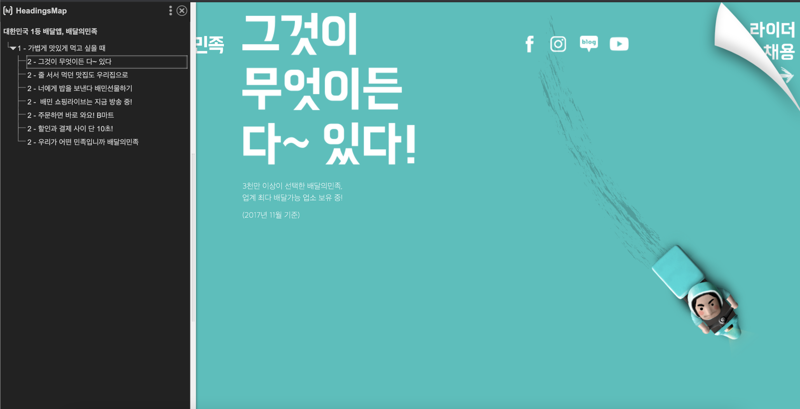
  - [Web Acessibility Tutorial - Multi level Headers](https://www.w3.org/WAI/tutorials/tables/multi-level/)

    - 때에 따라 두 개 이상의 헤더 수준이 있는 복잡한 표가 있을 때 기본 표 속성이 모든 필요한 구조적 정보를 제공하기에 충분하지 않을 수 있다. 이러한 종류의 복잡한 표의 경우, headers 및 id 특성을 사용하여 헤더와 헤더 관련 셀 간에 직접적인 관계를 만든다.
      ```html
      […]
      <td id="blank">&nbsp;</td>
      <th id="co1" headers="blank">Example 1 Ltd</th>
      <th id="co2" headers="blank">Example 2 Co</th>
      […]
      <th id="c1" headers="blank">Contact</th>
      […]
      ```
      ```html
      <td headers="co1 c1">James Phillips</td>
      <td headers="co2 c1">Marie Beauchamp</td>
      ```

  - 네이버 로그인 페이지
    - `<form>`에서 각 checkbox의 label은 보조 기술에 의해 프로그래밍 방식으로 결정될 수 있다.
    - `로그인 상태 유지` checkbox에 tab을 통해 이동할 수 있고, space bar를 통해 체크 및 체크 해제가 가능하다.  
      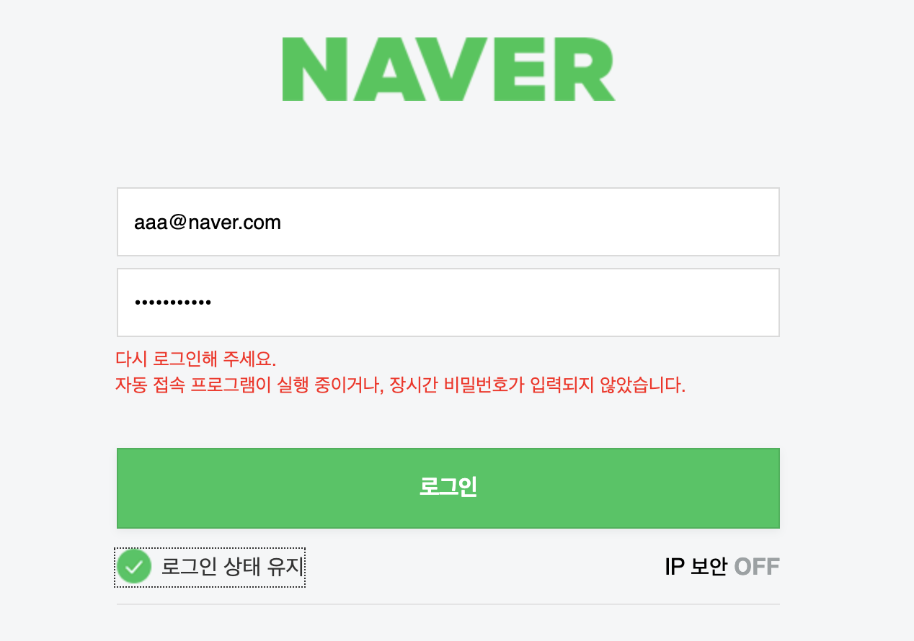

### 1.3.2 Meaningful Sequence

> (의미 있는 순서) 콘텐츠를 표현하는 순서가 콘텐츠의 의미에 영향을 준다면 정확한 읽기 순서를 프로그래밍 방식으로 확인할 수 있어야 한다.

- 사례

  - Meaningful Sequence를 준수하지 않은 사례: 아래 웹페이지는 스크린 리더가 두 개의 제목을 읽은 다음 콘텐츠를 읽는 방식으로 작성되었다.

  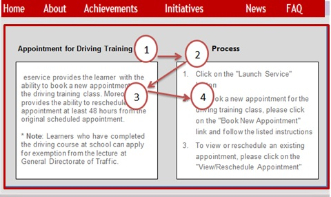

  - Meaningful Sequence를 준수한 사례: 아래 웹페이지는 올바르게 코딩되었으므로 읽기 순서가 더 논리적이고 각 제목이 관련 콘텐츠 앞에 존재한다.

  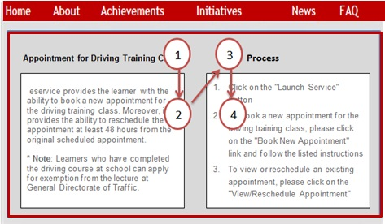

### 1.3.3 Sensory Characteristics

> (감각 특성) 콘텐츠를 이해하고 이용하기 위해 제공되는 설명은 모양이나 색상, 크기, 시각적 위치, 방향, 소리 등 감각적 특성에만 의존하지 않는다.

- 사례

  - 기준을 지키지 못한 사례: [코로나 실시간 상황판](https://coronaboard.kr/)에 있는 아래 그래프는 색상에 의존하고 있는 그래프이다. 만약, 해당 콘텐츠가 흑백으로 인식이 된다면 치료중, 누적확진, 누적사망, 누적완치에 대한 구분이 어렵다.
    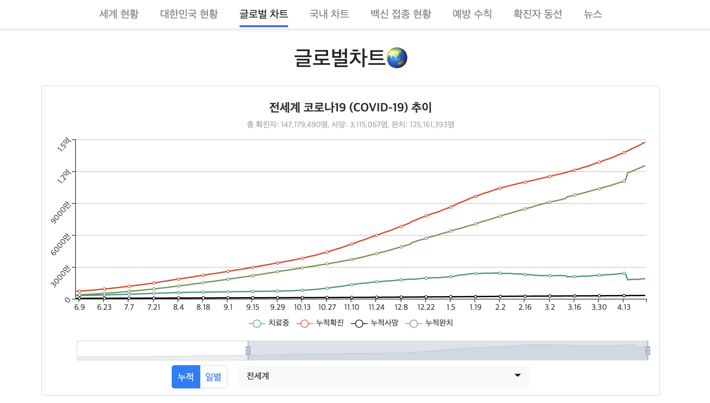

  - 기준을 지킨 사례: 아래 이미지에서는 각 선이 다른 모양으로 구분되어 있기 때문에 색상에 의존하고 있지 않다.
    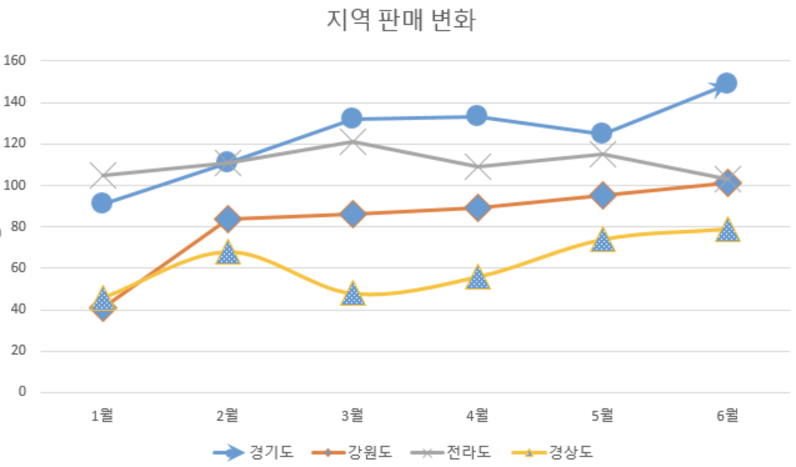

### 1.3.4 Orientation

> (방향) 콘텐츠는 세로 또는 가로와 같이 한 방향으로만 표시하거나 작동하도록 제한하지 않아야 한다. 특정 방향이 반드시 필요한 경우는 제외한다.

- 특정 방향이 반드시 필요한 경우로는 은행 수표, 피아노 애플리케이션, 프로젝터 등이 있다.
- 사례: 페이스북

  - 페이스북의 경우 가로 모드와 세로 모드를 모두 지원한다.
  - 세로 모드
    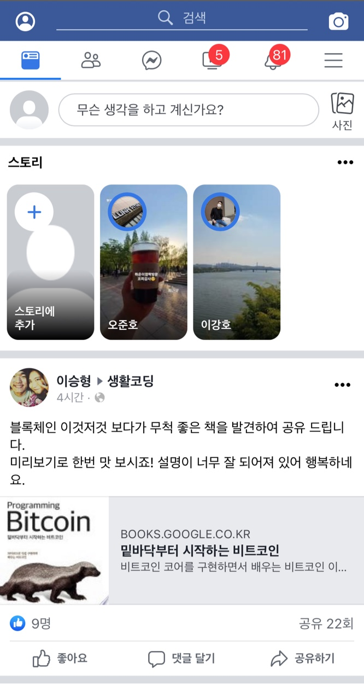

  - 가로 모드
    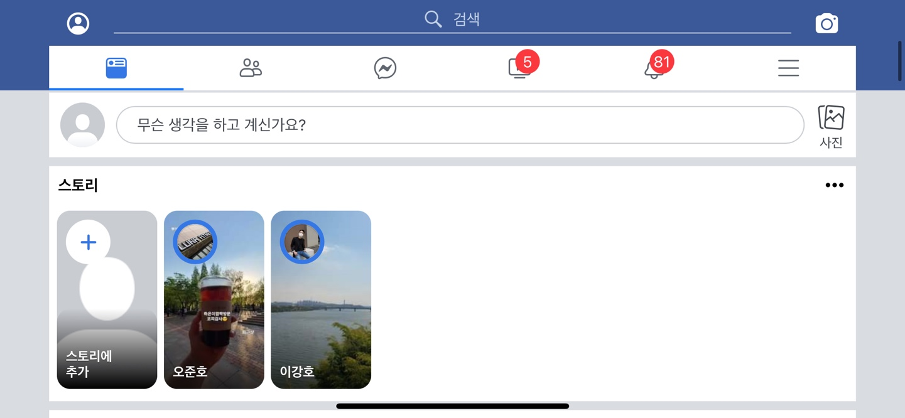

### 1.3.5 Identify Input Purpose

> (입력 목적 확인) 사용자에 관한 정보를 수집하는 각 입력 필드의 목적은 다음과 같은 경우 프로그래밍 방식으로 결정한다.

- 입력 필드를 [Input Purposes for User Interface Components section](https://www.w3.org/TR/WCAG21/#input-purposes)에서 확인된 목적에 따라 사용하는 경우
- 콘텐츠가 서식 입력 떼이터의 예상할 수 있는 의미를 식별할 수 있도록 지원하는 기법을 사용하여 실행하는 경우

- 이 기준은 사용자 정보 입력 필드의 용도를 구체적으로 명시하여 쉽게 `autocomplete`할 수 있도록 돕는다.
- 프로그램으로 결정한다는 것은 보조기기가 해석 가능한 방식으로 마크업한다는 것을 의미한다. 유저 에이전트와 보조기기는 [Input Purposes for User Interface Components section](https://www.w3.org/TR/WCAG21/#input-purposes)에 명시한 것만 해석할 수 있다.
  - 사용자 에이전트(user agent)는 사용자를 대표하는 컴퓨터 프로그램으로, 웹 맥락에선 브라우저를 의미한다.
- 예를 들어, 생년월일을 입력받기 위해 `<input>` 요소를 마크업 할 때 `type="date"만으로는 충분하지 않다. `autocomplete="bday" 속성을 명시함으로써 "날짜"보다 더 구체적인 "생일"이라는 정보를 제공하고 유저 에이전트가 지원하는 자동완성 기능을 사용할 수 있다. 추가로 `autocomplete="bday"`요소에 생일 케이크 아이콘을 제공하면 문자보다 이미지에 의존하는 사람을 돕는다.
- 또 다른 예로, `Name(autocomplete="name")`, `Given Name(autocomplete="given-name")`, `Family Name(autocomplete="family-name”)`, `Username(autocomplete="username”)`, `Nickname(autocomplete="nickname”)` 등이 있다.
- 이 성공 기준을 준수하면 유저 에이전트의 자동완성 기능을 사용할 수 있고 사용자는 입력 양식을 채우기 위해 기억 능력과 운동 능력에 의존하지 않아도 된다. 입력 필드에 아이콘 이미지를 추가하면 문자 판독 능력에 의존하지 않아도 된다.

- 입력 필드 용도를 프로그램으로 결정한 예제 코드

```html
<label for="birthday">생년월일:</label>
<input id="birthday" type="date" autocomplete="bday" />
```

```css
[autocomplete="bday"] {
  background: url("../img/birthday-cake-icon.png") no-repeat 0;
}
```

- 생일 input에 달력 대신 케이크 아이콘을 제공
  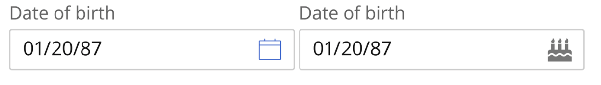

### 1.3.6 Identify Purpose

> (목적 확인) 마크업 언어로 구현된 콘텐츠에서 사용자 인터페이스 컴포넌트와 아이콘, 영역의 목적은 프로그래밍 방식으로 결정한다.

- 보조기기가 이해할 수 있도록 용도를 구체적으로 명시한 콘텐츠는 개인에 알맞는 방식으로 강조 또는 숨길 수 있다. 즉, Indentify Purpose는 개인화를 지원하기 위한 의도를 가지고 있다.
- WAI-ARIA 랜드마크 역할을 사용하여 개인에게 유익한 콘텐츠를 식별하고, 개인에게 의미 없는 내용은 숨길 수 있다. 예를 들면, 웹 페이지에서 `<main>` 또는 `role=["main"]`영역을 나에게 필요한 영역으로 판단하여 강조할 수 있다. 그리고 `<aside>` 또는 `role="complementary"`영역을 나에게 불필요한 영역으로 판단하여 숨길 수 있다.
- Identify Purpose를 준수하면 기억, 집중, 언어, 실행과 결정 장애가 있는 사용자를 도울 수 있다. 익숙한 기호, 적은 기능, 키보드 단축키 지원이 필요한 사람을 돕는다.
- 사례: [ARIA Landmarks Example](https://www.w3.org/TR/2017/NOTE-wai-aria-practices-1.1-20171214/examples/landmarks/)

  - 개인의 선호에 따라 콘텐츠를 숨길 수 있다.
  - navigation 숨기기 전
    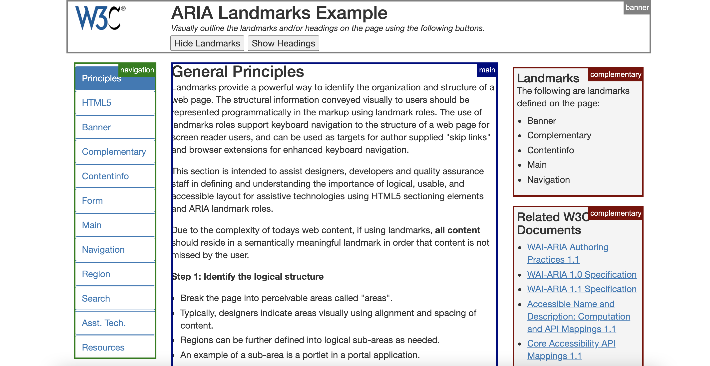

  - navigation 숨기기 후
    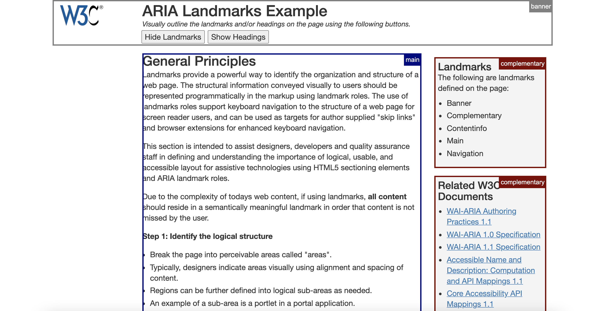

# 1.4 Distinguishable(구별성)

## 배경에서 전경을 분리하는 등 사용자가 더 쉽게 콘텐츠를 보고 들을 수 있게 하는 것입니다.

### (1)색 사용 지양: 시각 요소를 구별하는 유일한 시각적 수단으로 생상을 사용하지 않아야 합니다.

- [색각 이상자들을 위한 네이버(지식쇼핑)]
- 

### (2)오디오 제어: 오디오가 자동 재생된다면 그에 대한 제어할 수 있는 메커니즘을 제공해야합니다.

- [W3C 사이트의 재생 제어 버튼들]
- 

### (3)명암대비: 큰 텍스트, 부수적 텍스트, 로고타입등 텍스트의 종류에 따라 명암비를 다르게 하여 더 쉽게 알아 볼 수 있도록합니다.

- [성공 기준을 만족하는 폼 콘트롤: 보더와 면의 명도 대비가 충분하다.]
- 

### (4)텍스트 이미지 지양: 로고 타입과 같이 필수적인 경우를 제외하고 텍스트 이미지보다 텍스트를 통해 정보를 전달해야 합니다.

- [구글 메인페이지의 로고]
- 

### (5)재배치: 2차원 레이아웃으로 되어있는 부분을 재배치하여 스크롤을 하지 않고도 콘텐츠를 표현할 수 있습니다.

- [대표 예시: 반응형 웹]
- 

### (6)텍스트 간격: 줄높이, 단락 간격, 자간 등을 조절하여 사용자에게 더 쉽게 콘텐츠를 제공할 수 있습니다.

- [줄 간격을 조절할 때 텍스트가 잘리는 실패 사례]
- 수직 방향으로 텍스트가 잘림
- 

- [자간을 조절할 때 텍스트가 잘리는 실패 사례]
- 수평 방향으로 텍스트가 잘림
- 

- [줄 간격을 조절할 때 텍스트가 겹치는 실패 사례]
- 수직 방향으로 텍스트가 겹침
- 

### (7)포커스 시 주의할 점: 마우스나 키보드로 포커스하여 추가컨텐츠를 보였다 사라지게 하는 경우 아래 조건을 만족해야 합니다.

- 해제 가능: 마우스나 키보드 포커스를 움직이지 않고도 닫을 수 있는 메커니즘이 있어야합니다.
- 포인터로 가리키기 가능: 마우스 포인터로 추가 컨텐츠를 나타낼 경우, 추가 콘텐츠 위에서 포인터를 움직일 수 있어야합니다.
- 지속 가능: 사용자가 포커스를 제거하거나 콘텐츠를 닫거나 할 때까지 추가 콘텐츠가 보이도록 유지해야합니다.

- [추가 콘텐츠가 다른 콘텐츠를 가리는 경우.]
- 

- [수정 후]
- 
